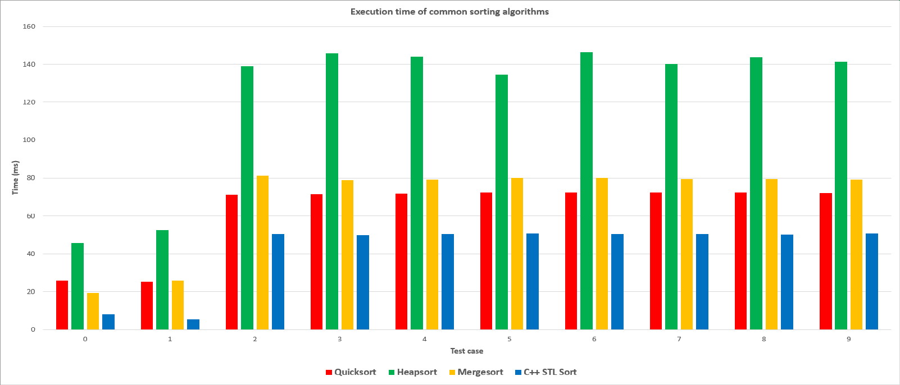

# Benchmark sorting algorithms

## Description

This project is to measure the execution time of Quicksort, Heapsort, Mergesort and `std::sort` of C++ STL.  

## Results

The first two test cases are increasing array and decreasing array. The others are random array.

### Table of execution time (ms):

| Test case | Quicksort | Heapsort  | Mergesort | C++ STL Sort
|-----------|-----------|-----------|-----------|--------------
| 0         | 25.866    | 45.755    | 19.35     | 7.899
| 1         | 25.142    | 52.578    | 25.59     | 5.419
| 2         | 71.166    | 139.09    | 81.071    | 50.646
| 3         | 71.37     | 145.876   | 79.032    | 49.77
| 4         | 71.967    | 143.968   | 79.136    | 50.568
| 5         | 72.524    | 134.464   | 80.088    | 50.895
| 6         | 72.539    | 146.555   | 80.112    | 50.489
| 7         | 72.328    | 140.056   | 79.401    | 50.185
| 8         | 72.419    | 143.849   | 79.554    | 50.125
| 9         | 72.066    | 141.267   | 79.352    | 50.92
| Average   | 62.7387   | 123.3458  | 68.2686   | 41.6916

### Chart of execution time:

<div align="center"> 
    
</div>

### Table of instructions, cache-misses (less is better)

| Algorithm    | Instructions | Cache-misses
|--------------|--------------|-------------
| Quicksort    | 19717487159  | 1276707
| Heapsort     | 22425146082  | 69918264
| Mergesort    | 20597831400  | 2276122
| C++ STL Sort | 17847756639  | 881949

### This benchmarking is run on:
* **OS**: Gentoo/Linux x86_64
* **Kernel**: Kernel: 5.15.23-gentoo-dist
* **CPU**: AMD Ryzen 5 5600H with Radeon Graphics (12) @ 3.300GHz
* **GPU**: AMD ATI Radeon RX 5500/5500M / Pro 5500M
* **GPU**: AMD ATI 07:00.0 Cezanne
* **Memory**: 8GB DDR4
* **g++ version**: (Gentoo 11.2.1_p20220115 p4) 11.2.1

According to those infomations above we can easily realize that `std::sort` of C++ STL is far better than its opponents.

### `std::sort`

It seems like the are all average `O(N*log(N))` complexity, howerver, `std::sort` of C++ STL is better than the others. 
Why `std::sort` is so quick? Because most of `std::sort` implementations use Quicksort, (or usually a hybrid algorithm like Introsort, which combines Quicksort, Heapsort and Insertion sort).

> So, `std::sort` is also Quicksort but better :))

### Why Quicksort is faster than Mergesort?

Quicksort is faster than Mergesort because its cache performance is higher (less cache-misses) and it doesn't require extra space for merging operation as Mergesort.  
Sometime, Quicksort has `O(N^2)` in the worst case but we can avoid it by choosing random pivot.

### How about Quicksort and Heapsort?

When both algorithms have same complexity (`α*N*log(N)` for the Quicksort, and `β*N*log(N)` for the Heapsort), the Quicksort is faster because he has a proportionnality coefficient which equals the half of the Heapsort’s proportionnality coefficient; mathematically, we have:

```
α = β / 2
```

## How to run this project?

Clone the project and build it:

```
$ git clone https://github.com/woanmeo11/sorting-benchmark.git
$ cd sorting-benchmark
$ ./build.sh
```

To display help, run the binary without any arguments:

```
$ ./benchmark
Usage: benchmark [OPTION]...
Measure execution time of common sorting algorithms.

 --gentests	generate test cases

 --all		    equivalent to --heapsort --mergesort --quicksort --stlsort
 --heapsort	    measure execution time of Heapsort
 --mergesort	measure execution time of Mergesort
 --quicksort	measure execution time of Quicksort
 --stlsort	    measure execution time of std::sort of C++ STL
```

Then run `benchmark --gentests` to generate test cases:

```
$ ./benchmark --gentests
[*] Creating directory...
[*] Generating test case 0...
[*] Generating test case 1...
[*] Generating test case 2...
[*] Generating test case 3...
[*] Generating test case 4...
[*] Generating test case 5...
[*] Generating test case 6...
[*] Generating test case 7...
[*] Generating test case 8...
[*] Generating test case 9...
```

### Measure the execution time

Run `benchmark --all` to view the benchmarking progress:

```
$ ./benchmark --all
│ Test case │ Quicksort │ Heapsort  │ Mergesort │ C++ STL Sort
├───────────┼───────────┼───────────┼───────────┼──────────────
│ 0         │ 25.866    │ 45.755    │ 19.35     │ 7.899
│ 1         │ 25.142    │ 52.578    │ 25.59     │ 5.419
│ 2         │ 71.166    │ 139.09    │ 81.071    │ 50.646
│ 3         │ 71.37     │ 145.876   │ 79.032    │ 49.77
│ 4         │ 71.967    │ 143.968   │ 79.136    │ 50.568
│ 5         │ 72.524    │ 134.464   │ 80.088    │ 50.895
│ 6         │ 72.539    │ 146.555   │ 80.112    │ 50.489
│ 7         │ 72.328    │ 140.056   │ 79.401    │ 50.185
│ 8         │ 72.419    │ 143.849   │ 79.554    │ 50.125
│ 9         │ 72.066    │ 141.267   │ 79.352    │ 50.92
```

### Show the number of instructions and cache-misses

To view the number of instructions and cache-misses, we use a tool called `perf`. `--quicksort` option is used to investigate only Quicksort algorithm.

```
$ perf stat -e instructions,cache-misses ./benchmark --quicksort
│ Test case │ Quicksort
├───────────┼───────────
│ 0         │ 24.092
│ 1         │ 24.47
│ 2         │ 71.317
│ 3         │ 71.76
│ 4         │ 71.92
│ 5         │ 72.016
│ 6         │ 72.353
│ 7         │ 72.912
│ 8         │ 72.681
│ 9         │ 71.411

Performance counter stats for './benchmark --quicksort':

    19717487159      instructions:u
        1276707      cache-misses:u

    1.574716707 seconds time elapsed

    1.553707000 seconds user
    0.020004000 seconds sys
```

# References:

* [heap-quick-comparison.pdf](https://orbi.uliege.be/bitstream/2268/19656/1/heap-quick-comparison.pdf)
* [Memory location matters for performance](https://pythonspeed.com/articles/performance-memory-locality/)